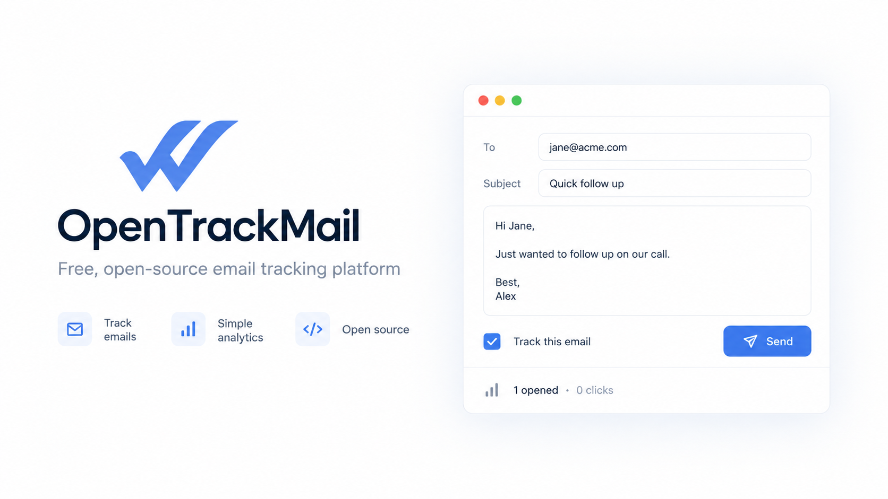

# OpenTrackMail

<p align="center">
  
</p>

<p align="center">
  <strong>Know when your emails are opened—without turning your inbox into a CRM.</strong>
</p>

<p align="center">
  Open-source email tracking for modern inboxes, built with Next.js, Supabase, and a Manifest V3 Chrome extension.
</p>

<p align="center">
  <a href="https://opentrackmail.com"><strong>Website</strong></a> ·
  <a href="docs/API.md">API docs</a> ·
  <a href="#private-self-hosting-guide">Self-hosting guide</a> ·
  <a href="docs/SEO_LAUNCH.md">SEO & launch</a>
</p>

<p align="center">
  <a href="LICENSE"></a>
  <a href="https://github.com/Luciano655dev/OpenTrackMail/actions/workflows/ci.yml"></a>
  
  
  
</p>



OpenTrackMail puts lightweight tracking signals where you already work. Write and send from your inbox as usual, see status beside sent messages, and use the private dashboard when you need the full timeline. It stores message metadata—not message bodies—and its complete tracking path is available for inspection.

> [!IMPORTANT]
> Email-open tracking is a useful signal, not proof that a person read a message. Image proxies, caching, privacy protection, scanners, and image blocking can all affect the result.

## What you get

- A browser extension with per-message tracking control.
- Gray and blue status checks directly in your inbox.
- First-open, latest-open, and detected-open summaries.
- A private, searchable web dashboard protected by Supabase RLS.
- A persistent light/dark theme that follows the system on first visit.
- A fast tracking-pixel endpoint with transactional duplicate filtering.
- Google authentication through Supabase using PKCE.
- A public marketing site and aggregate community Status page.
- A complete self-hosting path: your app, your Supabase project, your data.

## Contents

- [Architecture](#architecture)
- [Folder structure](#folder-structure)
- [Private self-hosting guide](#private-self-hosting-guide)
- [Environment variables](#environment-variables)
- [Local development](#local-development)
- [Google OAuth configuration](#google-oauth-configuration)
- [Deploy to Vercel](#deploy-to-vercel)
- [Tracking and Gmail details](#tracking-and-gmail-details)
- [Testing](#manual-testing)
- [Contributing](#contributing)
- [License](#license)

## Architecture

```text
Gmail content script
  ├─ registers a tracked email → app/API (Supabase user JWT)
  ├─ temporarily blocks that pixel only in the sender's Gmail tab
  ├─ inserts https://opentrackmail.com/t/<opaque-id>.gif
  └─ syncs recent summaries → Gmail checks + extension popup

Recipient email client
  └─ loads pixel → immediate transparent GIF response
                    └─ Next.js after() → service-role RPC → open_events + summary update

Dashboard server components
  └─ Supabase cookie session + RLS → tracked history and settings
```

`apps/dashboard` is the unified web project: marketing lives at `/`, the signed-in product lives at `/app`, APIs live at `/api`, and tracking pixels live at `/t`. The whole site deploys as one Vercel project on one origin. The pixel URL contains a cryptographically random 192-bit base64url ID, never a database UUID. Event writes run after the image response. The PostgreSQL function applies the duplicate and abuse heuristics transactionally.

## Folder structure

```text
opentrackmail/
├── apps/
│   ├── dashboard/              # unified site + /app + API + pixel endpoint, Next.js
│   │   └── .env.example        # dashboard/server configuration template
│   └── extension/              # Chrome MV3, CRXJS/Vite, Gmail provider
│       └── .env.example        # public extension build configuration
├── packages/shared/            # API schemas and shared TypeScript types
├── supabase/
│   ├── migrations/             # PostgreSQL schema, RLS, RPC
│   ├── tests/                  # pgTAP RLS contract
│   └── seed.sql
├── docs/
│   ├── API.md
│   ├── CHROME_WEB_STORE.md
│   ├── MANUAL_TESTING.md
│   └── SEO_LAUNCH.md
└── package.json                # npm workspaces
```

## Private self-hosting guide

This walkthrough creates a fully independent OpenTrackMail installation. Your fork will use **your own Supabase database**, **your own Google OAuth app**, and **your own deployment**. Nothing in the application needs access to the original OpenTrackMail Supabase project.

There are two useful development modes:

| Mode | Supabase | Web app | Best for |
| --- | --- | --- | --- |
| Hosted-first | Your hosted Supabase project | Localhost, then Vercel | The simplest setup and the path described below |
| Fully local | Supabase CLI + Docker | Localhost | Database development, migration work, and disposable test data |

The hosted-first path is the easiest way to make a personal copy that continues working when your computer is off.

### 1. Prerequisites

Install or create the following before you begin:

- [Git](https://git-scm.com/) 2.40 or newer.
- [Node.js](https://nodejs.org/) 20.19 or newer and npm 10 or newer.
- A recent version of Google Chrome.
- A free [Supabase](https://supabase.com/) account.
- A [Google Cloud](https://console.cloud.google.com/) project for OAuth.
- A [Vercel](https://vercel.com/) account if you want a permanent public deployment.
- Optional: [cloudflared](https://developers.cloudflare.com/cloudflare-one/connections/connect-networks/downloads/) for testing real email opens while the web app runs locally.
- Optional: Docker Desktop if you want the fully local Supabase stack.

Check the local tools:

```bash
git --version
node --version
npm --version
google-chrome --version 2>/dev/null || true
```

### 2. Clone and install

Fork the repository on GitHub if you plan to keep changes, then clone either your fork or the upstream project:

```bash
git clone https://github.com/luciano655dev/OpenTrackMail.git
cd OpenTrackMail
npm install
```

The repository uses npm workspaces. Run `npm install` only at the repository root; it installs the dashboard, extension, and shared-package dependencies together.

Create local environment files from the safe template:

```bash
cp apps/dashboard/.env.example apps/dashboard/.env.local
cp apps/extension/.env.example apps/extension/.env.local
```

These files are ignored by Git. Never commit a real service-role key, Google client secret, or hashing secret.

### 3. Create your Supabase project

1. In the Supabase dashboard, choose **New project**.
2. Select an organization, enter a project name, and generate a strong database password.
3. Choose a region close to the users of your installation.
4. Wait for provisioning to finish.
5. Open **Project Settings → API** (or **Connect**, depending on the current Supabase dashboard).
6. Record the following values:
   - Project URL, similar to `https://abcdefgh.supabase.co`.
   - Publishable or legacy `anon` key. This may be used in browser code.
   - `service_role` secret. This is server-only and bypasses RLS.
7. Record the project reference from the project URL or settings. In the example above it is `abcdefgh`.

The application requires the service-role key because tracking pixels arrive without a signed-in browser session. The key is used only in Next.js server code. If it appears in an extension file, a `VITE_*` value, client-side JavaScript, a screenshot, or Git history, rotate it immediately.

### 4. Apply the database schema

The committed SQL migrations are the source of truth. Apply them with the Supabase CLI instead of copying individual statements into the SQL editor:

```bash
npx supabase login
npx supabase link --project-ref YOUR_PROJECT_REF
npx supabase db push
```

The link command asks for the database password created in the previous step. `db push` applies every unapplied file in `supabase/migrations` in timestamp order.

After the push, inspect **Database → Tables** and confirm these tables exist:

- `profiles`
- `settings`
- `tracked_emails`
- `open_events`
- `api_rate_limits`

Also confirm that Row Level Security is enabled. The migration creates ownership policies so signed-in users can see only their own profile, settings, tracked messages, and open events. It also creates:

- A trigger that provisions a profile and settings row for each new auth user.
- A service-role-only function that records open events.
- Duplicate and first-request filtering used by the tracking pixel.
- Supporting indexes for history, search, matching, and deduplication.

You can safely run `npx supabase db push` again later; already-applied migrations are not rerun.

### 5. Create a Google OAuth client

OpenTrackMail signs users in with Google identity but does **not** request Gmail API access.

1. Open Google Cloud Console and create or select a project.
2. Go to **Google Auth Platform** (or **APIs & Services → OAuth consent screen**).
3. Configure the app name, support email, and developer contact.
4. Choose **External** unless every intended user belongs to one Google Workspace organization.
5. Request only `openid`, `email`, and `profile` scopes.
6. Keep the app in **Testing** while setting up a personal instance.
7. Add your Google address under **Test users**. Add nobody else if the deployment should be yours alone.
8. Create an OAuth client with application type **Web application**.
9. Add this exact authorized redirect URI, replacing the project reference:

   ```text
   https://YOUR_PROJECT_REF.supabase.co/auth/v1/callback
   ```

10. Save the Google client ID and client secret.

Keeping the Google OAuth app in Testing and limiting its test-user list is the simplest personal-installation gate. Supabase RLS still isolates records if you later add more users. For a public project, publish the OAuth consent screen only after reviewing Google’s current verification requirements.

### 6. Enable Google in Supabase

1. Open **Authentication → Providers → Google** in Supabase.
2. Enable the provider.
3. Paste the Google client ID and client secret.
4. Save the provider configuration.
5. Open **Authentication → URL Configuration**.
6. During local development, set the Site URL to:

   ```text
   http://localhost:3001/app
   ```

7. Add this redirect URL:

   ```text
   http://localhost:3001/auth/callback
   ```

You will return here after Chrome assigns an extension ID and after you create a production domain.

### 7. Configure the dashboard environment

Edit `apps/dashboard/.env.local` and fill in the dashboard values:

```dotenv
NEXT_PUBLIC_SUPABASE_URL=https://YOUR_PROJECT_REF.supabase.co
NEXT_PUBLIC_SUPABASE_ANON_KEY=YOUR_PUBLISHABLE_OR_ANON_KEY
SUPABASE_SERVICE_ROLE_KEY=YOUR_SERVICE_ROLE_KEY

NEXT_PUBLIC_SITE_URL=http://localhost:3001
TRACKING_PIXEL_ORIGIN=https://YOUR_TEMPORARY_PUBLIC_HTTPS_ORIGIN
ALLOWED_EXTENSION_ORIGINS=
EVENT_HASH_SECRET=YOUR_RANDOM_SECRET
```

Generate the event-hashing secret locally:

```bash
openssl rand -base64 48
```

Copy the command output into `EVENT_HASH_SECRET`. This secret creates privacy-preserving request signatures used for short-window duplicate detection. Do not reuse your database password or service-role key.

For initial UI work, `TRACKING_PIXEL_ORIGIN` may temporarily be `http://localhost:3001`. Before sending a real test email, replace it with an HTTPS tunnel or deployed origin; recipients cannot load your computer’s localhost.

### 8. Configure and build the Chrome extension

Edit `apps/extension/.env.local`:

```dotenv
VITE_API_URL=http://localhost:3001
VITE_APP_URL=http://localhost:3001/app
VITE_SUPABASE_URL=https://YOUR_PROJECT_REF.supabase.co
```

Only `VITE_*` values are compiled into the extension. They are public by design. Do not add `SUPABASE_SERVICE_ROLE_KEY`, `EVENT_HASH_SECRET`, or a Google client secret to this file.

Build the extension:

```bash
npm run build -w @opentrackmail/extension
```

Then load it in Chrome:

1. Open `chrome://extensions`.
2. Enable **Developer mode**.
3. Choose **Load unpacked**.
4. Select the generated `apps/extension/dist` directory.
5. Copy the extension ID shown by Chrome.
6. In Supabase **Authentication → URL Configuration**, add:

   ```text
   https://YOUR_EXTENSION_ID.chromiumapp.org/supabase-auth
   ```

7. Set the dashboard allowlist to the exact origin:

   ```dotenv
   ALLOWED_EXTENSION_ORIGINS=chrome-extension://YOUR_EXTENSION_ID
   ```

8. Restart the dashboard after changing its environment file.
9. Click the extension’s **Reload** button after every new extension build, then refresh any already-open Gmail tabs.

The unpacked extension ID normally stays stable on one Chrome profile as long as you keep loading the same manifest from the same folder. A Chrome Web Store release receives its own ID and therefore needs an additional Supabase redirect URL and allowlisted origin.

### 9. Start the app and verify sign-in

Run the web app and extension watcher together:

```bash
npm run dev
```

Open `http://localhost:3001`, choose **Sign in**, and complete Google authentication. After the callback:

1. Confirm the dashboard opens at `/app`.
2. In Supabase **Authentication → Users**, confirm your user exists.
3. In **Table Editor → profiles**, confirm the user trigger created a matching row.
4. In **Table Editor → settings**, confirm a settings row exists.
5. Open the extension popup and confirm it recognizes the same session.

If Google returns `redirect_uri_mismatch`, compare the Google redirect URI character-for-character with the Supabase callback URL—not the application callback URL. If Supabase rejects the extension callback, confirm the `.chromiumapp.org/supabase-auth` URL is in the Supabase redirect allowlist.

### 10. Test a real open with an HTTPS tunnel

A tracking image in somebody else’s inbox cannot reach `localhost`. For a temporary end-to-end test, keep the app local but give port 3001 a public HTTPS address:

```bash
cloudflared --config /dev/null tunnel --url http://localhost:3001
```

Copy the generated `https://…trycloudflare.com` origin, then change:

```dotenv
# apps/dashboard/.env.local
TRACKING_PIXEL_ORIGIN=https://YOUR_TUNNEL.trycloudflare.com

# apps/extension/.env.local
VITE_API_URL=https://YOUR_TUNNEL.trycloudflare.com
```

Restart the dashboard, rebuild the extension, reload it in Chrome, and refresh Gmail. Before sending, open:

```text
https://YOUR_TUNNEL.trycloudflare.com/api/health
```

The expected response is `{ "ok": true }`. Send a tracked message to a different inbox, load its images, and check both Gmail’s sent row and the dashboard. Quick Tunnel domains change on restart, so rebuild/reload the extension whenever the URL changes.

### 11. Deploy your private web app to Vercel

1. Push your fork to GitHub.
2. In Vercel, choose **Add New → Project** and import the fork.
3. Set **Root Directory** to `apps/dashboard`.
4. Keep the detected framework as Next.js.
5. Add every dashboard environment variable from step 7.
6. Set both of these to your final HTTPS origin:

   ```dotenv
   NEXT_PUBLIC_SITE_URL=https://YOUR_DOMAIN
   TRACKING_PIXEL_ORIGIN=https://YOUR_DOMAIN
   ```

7. Keep `ALLOWED_EXTENSION_ORIGINS=chrome-extension://YOUR_EXTENSION_ID` for your unpacked extension.
8. Deploy and confirm `https://YOUR_DOMAIN/api/health` returns `{ "ok": true }`.
9. In Supabase Auth URL Configuration:
   - Change Site URL to `https://YOUR_DOMAIN/app`.
   - Add `https://YOUR_DOMAIN/auth/callback` to Redirect URLs.
   - Keep the Chromium callback from step 8.
10. Update the extension environment:

    ```dotenv
    VITE_API_URL=https://YOUR_DOMAIN
    VITE_APP_URL=https://YOUR_DOMAIN/app
    VITE_SUPABASE_URL=https://YOUR_PROJECT_REF.supabase.co
    ```

11. Rebuild and reload the extension one final time.

Vercel must receive the service-role and event-hashing secrets as server environment variables. They must never be prefixed with `NEXT_PUBLIC_`.

### 12. Keep the installation personal

For a single-user copy:

- Leave the Google OAuth consent screen in Testing.
- Keep only your address in Google’s test-user list.
- Do not publish the extension to the Chrome Web Store; load it unpacked in your own profile.
- Do not share the Vercel project, Supabase organization, database password, or service-role key.
- Keep Supabase RLS enabled even for a one-person install.
- Turn on MFA for GitHub, Google, Supabase, and Vercel.
- Review Supabase Authentication logs after setup and rotate any secret accidentally exposed.

Your data is isolated from the public OpenTrackMail installation because all application reads and writes point to the `NEXT_PUBLIC_SUPABASE_URL`/`VITE_SUPABASE_URL` you configured. The public Status page in your copy will report aggregate totals from **your** database. Its homepage social-proof strip appears only after that database contains more than 10 accounts.

### 13. Updating your fork

If you cloned the upstream repository directly, pull updates normally. If you created a fork, add the original repository as an upstream remote once:

```bash
git remote add upstream https://github.com/luciano655dev/OpenTrackMail.git
git fetch upstream
git checkout main
git merge upstream/main
npm install
npx supabase db push
npm run check
```

Read new migrations before applying them, keep a Supabase backup for important data, and rebuild the extension after any change under `apps/extension` or `packages/shared`.

### Self-hosting troubleshooting

| Symptom | Most likely cause | What to check |
| --- | --- | --- |
| Google shows `redirect_uri_mismatch` | Wrong URI in Google Cloud | Google must allow the Supabase `/auth/v1/callback` URI |
| Login returns to the site but no session exists | App callback not allowed | Add `/auth/callback` for the exact app origin in Supabase |
| Extension login closes without succeeding | Chromium callback missing | Add the exact extension ID callback in Supabase |
| Extension API says origin is forbidden | Allowlist mismatch | Use `chrome-extension://ID` with no trailing slash |
| Tracking record is created but opens never appear | Pixel origin is unreachable | Use public HTTPS and check `/api/health` |
| First request does not count | Expected anti-proxy behavior | The first pixel request is intentionally ignored |
| Status metrics show unavailable | Server credentials invalid | Check server-only Supabase values in the dashboard environment |
| Browser build contains a secret | Secret used with a public prefix | Remove it, rotate it, and use only server environment variables |

If setup still fails, run the quality commands below and work through [docs/MANUAL_TESTING.md](docs/MANUAL_TESTING.md) from top to bottom.

## Environment variables

Each workspace owns its configuration template. Copy `apps/dashboard/.env.example` and `apps/extension/.env.example` to `.env.local` in the same directory.

| Variable | Used by | Purpose |
| --- | --- | --- |
| `NEXT_PUBLIC_SUPABASE_URL` | dashboard | Supabase project URL. Public by design. |
| `NEXT_PUBLIC_SUPABASE_ANON_KEY` | dashboard | Supabase publishable/anon key. Public; RLS protects records. |
| `SUPABASE_SERVICE_ROLE_KEY` | dashboard server only | Pixel RPC and account deletion. Never expose or prefix with `NEXT_PUBLIC_`/`VITE_`. |
| `EVENT_HASH_SECRET` | dashboard server only | At least 32 random bytes for HMAC request signatures. Generate with `openssl rand -base64 48`. |
| `TRACKING_PIXEL_ORIGIN` | dashboard server | Public HTTPS origin embedded in messages. Use a tunnel locally and `https://opentrackmail.com` in production. |
| `ALLOWED_EXTENSION_ORIGINS` | dashboard server | Comma-separated exact `chrome-extension://…` origins. Empty permits extension origins in local development only. |
| `NEXT_PUBLIC_SITE_URL` | unified web app | Canonical public origin used for metadata. |
| `GOOGLE_SITE_VERIFICATION` | dashboard server | Optional Google Search Console HTML-tag verification token. |
| `VITE_API_URL` | extension build | API origin. |
| `VITE_APP_URL` | extension build | Product base URL opened from the popup, including `/app`. |
| `VITE_SUPABASE_URL` | extension build | Supabase project URL used to begin Google OAuth. |

## Supabase setup

1. Create a Supabase project and save its project URL, anon/publishable key, and service-role key.
2. Install the Supabase CLI and authenticate: `npm install -g supabase`, then `supabase login`.
3. From this repository, run `supabase link --project-ref <project-ref>`.
4. Apply the schema: `supabase db push`.
5. In Authentication → Providers → Google, enable Google and enter the Google client ID/secret described below.
6. In Authentication → URL Configuration set Site URL to `https://opentrackmail.com/app`.
7. Add redirect URLs:
   - `http://localhost:3001/auth/callback`
   - `https://opentrackmail.com/auth/callback`
   - `https://<unpacked-extension-id>.chromiumapp.org/supabase-auth`
   - `https://<chrome-web-store-id>.chromiumapp.org/supabase-auth` when assigned
8. Confirm email confirmations and any magic-link settings match your launch policy. Google is the implemented primary login.
9. Run `supabase test db` locally to check the pgTAP RLS contract.

The new-user trigger creates `profiles` and `settings`. RLS prevents authenticated users from reading or modifying another user's rows. `open_events` is read-only to users and visible only through ownership of its parent email.

## Local development

Prerequisites: Node.js 20.19+, npm 10+, Docker Desktop for local Supabase, and Chrome.

```bash
cp apps/dashboard/.env.example apps/dashboard/.env.local
cp apps/extension/.env.example apps/extension/.env.local
npm install
supabase start
supabase db reset
npm run dev
```

Replace the placeholder Supabase values in both `.env.local` files with values printed by `supabase status`. The unified site runs at `http://localhost:3001` with the product under `/app`, and the extension rebuilds into `apps/extension/dist`.

### Test recipient opens while everything is local

An email recipient cannot load `localhost` from your computer, and HTTPS webmail can block an HTTP image. Keep the application local but give the tracking endpoint a temporary public HTTPS address:

1. Start the dashboard on port 3001.
2. In another terminal run `cloudflared --config /dev/null tunnel --url http://localhost:3001`. The empty config prevents any existing named-tunnel ingress on the machine from overriding this temporary tunnel.
3. Copy the generated `https://…trycloudflare.com` URL.
4. Set `TRACKING_PIXEL_ORIGIN` in `apps/dashboard/.env.local` to that URL and restart the dashboard.
5. Set `VITE_API_URL` in `apps/extension/.env.local` to the same URL and rebuild the extension.
6. Reload the unpacked extension at `chrome://extensions` and refresh Gmail.
7. Confirm `<tunnel-url>/api/health` returns `{ "ok": true }` before sending.

Quick Tunnel URLs change whenever the tunnel restarts, so repeat steps 3–6 after receiving a new URL. The authenticated extension API is also routed through the tunnel; authentication, RLS, and API rate limiting remain active. Do not treat a Quick Tunnel as a production deployment.

Quality commands:

```bash
npm run typecheck
npm test
npm run build
```

## Install the Chrome extension locally

1. Set extension `.env.local` values and run `npm run build -w @opentrackmail/extension`.
2. Open `chrome://extensions`, enable Developer mode, and click Load unpacked.
3. Select `apps/extension/dist`, not `apps/extension`.
4. Copy the displayed extension ID.
5. Add `https://<extension-id>.chromiumapp.org/supabase-auth` to Supabase Auth redirect URLs.
6. Restart the sign-in flow from the popup. Chrome's OAuth redirect is derived from that extension ID.
7. After rebuilding, click the extension's Reload button. Refresh existing Gmail tabs so the new content script loads.

## Google OAuth configuration

1. In Google Cloud Console, create or select a project and configure the OAuth consent screen.
2. Use the minimum identity scopes (`openid`, `email`, `profile`). OpenTrackMail does not use Gmail API scopes.
3. Create a **Web application** OAuth client for Supabase.
4. Add `https://<project-ref>.supabase.co/auth/v1/callback` as an authorized redirect URI.
5. Add `https://<project-ref>.supabase.co` and your production domains as authorized JavaScript origins if Google requests them.
6. Paste the client ID and secret into Supabase Authentication → Providers → Google.
7. Add test users while the Google consent screen is in Testing status; publish/verify the consent screen before a public launch if Google requires it.

The extension also authenticates through Supabase. It uses Chrome `launchWebAuthFlow`, PKCE, and a Chromium-owned callback URL. No service key or Google client secret is shipped in the extension.

## Deploy to Vercel

Create one Vercel project from this repository.

1. Import the repository and set Root Directory to `apps/dashboard`.
2. Keep Framework Preset as Next.js.
3. Set all dashboard variables from the table above for Production and Preview as appropriate.
4. Use `NEXT_PUBLIC_SITE_URL=https://opentrackmail.com` and `TRACKING_PIXEL_ORIGIN=https://opentrackmail.com`.
5. Set `ALLOWED_EXTENSION_ORIGINS` to exact development/store extension origins before production use.
6. Deploy, then attach both `opentrackmail.com` and `www.opentrackmail.com`. Redirect `www` to the apex in Vercel.
7. Call `https://opentrackmail.com/api/health`; expect `{ "ok": true }`.
8. Update the Supabase Site URL and redirect allowlist with the final domain.

Vercel's monorepo install runs at the repository root and resolves the shared workspace package. Do not add the service-role key to the Extension environment.

## DNS configuration

Use the exact values Vercel shows under each project's Domains screen; Vercel may prefer nameservers or different records for your account. A common external-DNS setup is:

| Host | Type | Target | Vercel project |
| --- | --- | --- | --- |
| `@` | `A` | `76.76.21.21` | unified web project |
| `www` | `CNAME` | `cname.vercel-dns.com` | unified web project, redirects to apex |

Remove conflicting A/AAAA/CNAME records. Wait for Vercel to verify ownership and issue TLS certificates. Set `TRACKING_PIXEL_ORIGIN` only after `opentrackmail.com` serves HTTPS. Never use an HTTP pixel in production because mail clients will block mixed or insecure content.

## Tracking and Gmail details

Gmail is a dynamic SPA. `providers/gmail/selectors.ts` is the repair boundary for DOM selectors. One observer detects compose windows and recycled Sent rows. Each compose has isolated state. Sends are intercepted only when tracking is on; record creation must succeed before one hidden image is appended and Gmail's send resumes. A local client UUID makes retrying record creation idempotent.

Sent-row matching prefers Gmail thread IDs when available and falls back to recent exact subject matching. The extension syncs at most every 45 seconds, runs a 60-second visible-tab interval, and refreshes on visibility or Gmail hash navigation. It does not continuously poll in background tabs.

Before Gmail Send resumes, the extension installs a temporary Manifest V3 session rule that blocks only the exact pixel URL in the initiating Gmail tab. The rule expires after 60 seconds and does not affect recipient devices. The API checks that the pixel origin is reachable before creating a tracking record. Because Gmail can also fetch the image from its servers while sending, the backend ignores a first request within 60 seconds of send. A first request after that window counts as an open. Requests with the same privacy-preserving source signature inside 10 seconds are stored as `rapid_duplicate` but do not inflate the displayed count.

## Chrome Web Store

See [docs/CHROME_WEB_STORE.md](docs/CHROME_WEB_STORE.md) for listing copy, every permission justification, asset sizes, privacy answers, packaging, and submission steps.

## Known limitations

- Open tracking only shows that the tracking image was requested. Proxying, preloading, caching, image blocking, security scanners, and privacy protections can produce false positives or missed opens.
- Recipient testing requires a publicly reachable HTTPS pixel origin. Use the documented Cloudflare tunnel locally or the production site origin after deployment.
- A recipient opening within 60 seconds of send can be missed if that load is the first pixel request. A later first load counts.
- The sender-tab protection covers the send-time load and immediate Gmail rerenders. Opening the sender's own Sent copy after the one-minute protection expires is indistinguishable from another image load.
- Gmail is the only supported provider in v1.
- Sent-row association is best when Gmail exposes a thread ID. Before that metadata is discoverable, exact subject matching is used and can be ambiguous when identical subjects are sent close together.
- Replies, forwards, scheduled send, offline send, keyboard shortcuts, and Gmail experiments can change compose behavior. Basic replies/forwards should work, but scheduled/offline send is not guaranteed.
- Gmail can change private DOM attributes. Selectors are centralized, but Chrome Web Store updates will be needed if Gmail breaks them.
- The popup shows the latest five server records. It is not a real-time push system; visible Gmail tabs update within roughly one minute.
- Browser notifications require the declared `notifications` permission and are off by default.
- The repository does not include production secrets, a Supabase project, DNS ownership, or a signed/published Chrome Web Store listing. Those require owner accounts.

## Manual testing

Use the complete [manual testing checklist](docs/MANUAL_TESTING.md). The definition-of-done path covers local install, Google sign-in, Gmail compose, single check, remote image load, double checks and tooltip, popup recent history, dashboard list, and detail activity.

## Contributing

Issues and pull requests are welcome at [github.com/luciano655dev/OpenTrackMail](https://github.com/luciano655dev/OpenTrackMail).

Before opening a pull request:

1. Keep changes focused and document any behavior or environment changes.
2. Add or update tests for security-sensitive and tracking behavior.
3. Run the complete local check:

   ```bash
   npm run check
   ```

4. Never include `.env` files, access tokens, message data, database dumps, or Chrome profiles.
5. Include manual verification notes for changes that touch Gmail DOM integration or extension permissions.

Please report suspected security vulnerabilities privately to `hello@opentrackmail.com` instead of opening a public issue containing exploit details or secrets.

## License

OpenTrackMail is open-source software available under the [MIT License](LICENSE). You may use, copy, modify, distribute, sublicense, and sell copies under the license terms. Attribution and the license notice must remain with substantial copies of the software.
